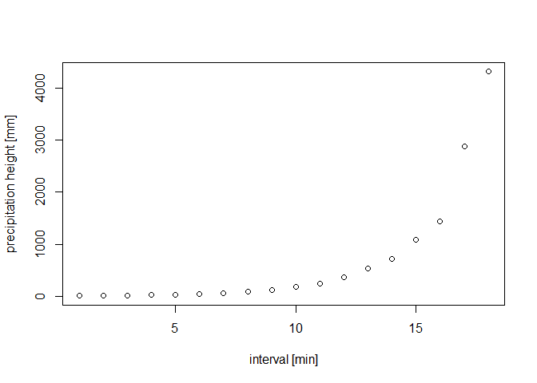

<!-- README.md is generated from README.Rmd. Please edit that file -->

# kostra2010R

<!-- badges: start -->
<!-- badges: end -->

The main goal of kostra2010R is to provide access to KOSTRA-DWD-2010R
dataset from within R.

Abstract from the [official
description](https://opendata.dwd.de/climate_environment/CDC/grids_germany/return_periods/precipitation/KOSTRA/KOSTRA_DWD_2010R/gis/DESCRIPTION_gridsgermany_return_periods_precipitation_KOSTRA_KOSTRA_DWD_2010R_gis_en.pdf):

*These vector data sets for GIS contain statistical precipitation values
as a function of the duration and the return period. The scope of the
data is the engineering dimensioning of water management structures.
These include, sewerage networks, sewage treatment plants, pumping
stations and retention basins. They are also often used for the
dimensioning of drainage systems and infiltration systems. With the help
of the data, however, it is also possible to estimate the precipitation
level of severe heavy precipitation events with regard to their return
periods. This estimation is often used to assess damage events.*

*The data set contains the vector data sets of all 18 duration levels. A
vecor data set contains the statistical precipitation (hN, design
precipitation) of the present duration level D for nine return periods
Tn (1-100 a) for the whole grid spanning 79 × 107 cells. INDEX_RC
describes the unique identifier of a grid cell.*

## Installation

You can install the development version of kostra2010R with:

``` r
# install.packages("devtools")
# devtools::install_github("falk-env/kostra2010R")
```

Then load the package with

``` r
library(kostra2010R)
```

## Usage

### Get “INDEX_RC” based on row and column information

Sometimes identification of grid cells is not accomplished using
“INDEX_RC” directly but rather using a combination of X and Y
information (e.g. column 11, row 49). This information can easily be
used to generate the necessary “INDEX_RC” field.

``` r
# Generate "INDEX_RC" out of X and Y information.
idx_build(11, 49)
#> [1] "49011"
```

If you wanted to check whether this constructed “INDEX_RC” field is
really present in the data set (or you found an ID in some report and
are not sure, if it is still being used), make use of the following
function.

``` r
# Is the following "INDEX_RC" entry present in the data set?
idx_exists("49011")
#> [1] TRUE
```

### Get “INDEX_RC” based on spatial information

The most common use case will be to get the relevant “INDEX_RC” based on
coordinates provided, e.g. for the location of a precipitation station
in order to be able to classify duration-specific precipitation heights
in terms of return periods.

``` r
# Sf objects created based on specified coordinates. Don't forget to pass the CRS.
p1 <- sf::st_sfc(
  sf::st_point(
    c(367773, 5703579)
  ),
  crs = 25832
)

p2 <- sf::st_sfc(
  sf::st_point(
    c(6.09, 50.46)
  ),
  crs = 4326
)

# Get indices by topological intersection between location point and grid cells.
idx_get(p1)
#> [1] "49011"
idx_get(p2)
#> [1] "61002"
```

### Cell-specific statistics from KOSTRA-DWD-2010R

Now that we have messed a little with the grid cell identifiers, let’s
get a sneak peek into the data set itself based on the “INDEX_RC”
specified.

``` r
# Build a tibble containing precipitation heights as a function of duration and return periods for the grid cell specified.
build_table("49011")
#> # A tibble: 18 x 11
#>    D_min D_hour HN_001A HN_002A HN_003A HN_005A HN_010A HN_020A HN_030A HN_050A
#>    <dbl>  <dbl>   <dbl>   <dbl>   <dbl>   <dbl>   <dbl>   <dbl>   <dbl>   <dbl>
#>  1     5   NA       5.6     6.9     7.7     8.7    10      11.3    12.1    13.1
#>  2    10   NA       8.6    10.6    11.7    13.1    15.1    17.1    18.2    19.6
#>  3    15   NA      10.5    13      14.4    16.2    18.6    21.1    22.5    24.3
#>  4    20   NA      11.8    14.7    16.4    18.5    21.4    24.3    25.9    28.1
#>  5    30   NA      13.5    17.1    19.2    21.9    25.5    29.1    31.2    33.9
#>  6    45   NA      14.9    19.4    22.1    25.4    29.9    34.4    37.1    40.4
#>  7    60    1      15.7    21      24.1    28      33.3    38.7    41.8    45.7
#>  8    90    1.5    17.4    22.9    26.2    30.2    35.7    41.2    44.4    48.5
#>  9   120    2      18.8    24.4    27.7    31.9    37.5    43.1    46.4    50.6
#> 10   180    3      20.9    26.7    30.1    34.4    40.2    46      49.4    53.7
#> 11   240    4      22.5    28.5    32      36.4    42.3    48.3    51.8    56.1
#> 12   360    6      25      31.2    34.8    39.3    45.5    51.7    55.3    59.8
#> 13   540    9      27.8    34.2    37.9    42.6    49      55.3    59.1    63.8
#> 14   720   12      30      36.5    40.3    45.1    51.6    58.2    62      66.8
#> 15  1080   18      33.3    40.1    44      49      55.7    62.5    66.4    71.4
#> 16  1440   24      35.9    42.8    46.8    51.9    58.8    65.8    69.8    74.9
#> 17  2880   48      44.1    52.2    57      62.9    71      79.1    83.8    89.8
#> 18  4320   72      49.8    58.6    63.7    70.2    79      87.7    92.9    99.3
#> # ... with 1 more variable: HN_100A <dbl>
```

The value of “INDEX_RC” has been assigned as an attribute to the tibble.

``` r
# Create tibble
data <- build_table("49011")

attr(data, "index_rc")
#> [1] "49011"
```

### Further utilization

Data can now be visualized in form of plots…

``` r
# Create tibble
data <- build_table("49011")

plot(data$D_min,
  data$HN_100A_,
  xlab = "interval [min]",
  ylab = "precipitation height [mm]"
)
#> Warning: Unknown or uninitialised column: `HN_100A_`.
```



… or exported to disk using `write.csv2()`.

## Contributing

See
[here](https://github.com/rywhale/kiwisR/blob/master/.github/CONTRIBUTING.md)
if you’d like to contribute.

## Legal information

According to the [terms of
use](https://opendata.dwd.de/climate_environment/CDC/Terms_of_use.pdf)
for data from GWS’ CDC-OpenData area, reely accessible data may be
re-used without any restrictions provided that the source reference is
indicated, as laid down in the
[GeoNutzV](http://www.gesetze-im-internet.de/geonutzv/index.html)
ordinance.

Copyright: [Deutscher
Wetterdienst](https://www.dwd.de/EN/service/copyright/templates_dwd_as_source.html)

## References

-   Deutscher Wetterdienst > Leistungen >
    [KOSTRA-DWD](https://www.dwd.de/DE/leistungen/kostra_dwd_rasterwerte/kostra_dwd_rasterwerte.html)
-   Deutscher Wetterdienst > OpenData > [KOSTRA-DWD raster
    data](https://opendata.dwd.de/climate_environment/CDC/grids_germany/return_periods/precipitation/KOSTRA/KOSTRA_DWD_2010R/)
