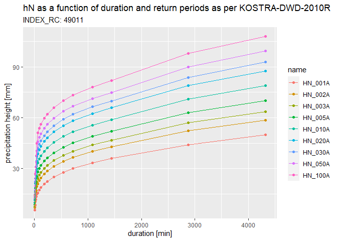

<!-- README.md is generated from README.Rmd. Please edit that file -->

# kostra2010R

<!-- badges: start -->
<!-- badges: end -->

The main goal of kostra2010R is to provide access to KOSTRA-DWD-2010R
dataset from within R.

Abstract from the [official dataset
description](https://opendata.dwd.de/climate_environment/CDC/grids_germany/return_periods/precipitation/KOSTRA/KOSTRA_DWD_2010R/gis/DESCRIPTION_gridsgermany_return_periods_precipitation_KOSTRA_KOSTRA_DWD_2010R_gis_en.pdf):

*These vector data sets for GIS contain statistical precipitation values
as a function of the duration and the return period. The scope of the
data is the engineering dimensioning of water management structures.
These include, sewerage networks, sewage treatment plants, pumping
stations and retention basins. They are also often used for the
dimensioning of drainage systems and infiltration systems. With the help
of the data, however, it is also possible to estimate the precipitation
level of severe heavy precipitation events with regard to their return
periods. This estimation is often used to assess damage events.*

*The data set contains the vector data sets of all 18 duration levels. A
vector data set contains the statistical precipitation (hN, design
precipitation) of the present duration level D for nine return periods
Tn (1-100 a) for the whole grid spanning 79 × 107 cells. INDEX_RC
describes the unique identifier of a grid cell.*

## Installation

You can install the development version of kostra2010R with:

``` r
# install.packages("devtools")
# devtools::install_github("falk-env/kostra2010R")
```

Then load the package with

``` r
library(kostra2010R)
```

## Usage

### Get “INDEX_RC” based on row and column information

Sometimes identification of grid cells is not accomplished using
“INDEX_RC” directly but rather using a combination of X and Y
information (e.g. column 11, row 49). This information can easily be
used to generate the necessary “INDEX_RC” field.

``` r
# Generate "INDEX_RC" based on X and Y information
idx_build(col = 11, row = 49)
#> [1] "49011"
```

If you wanted to check whether this constructed “INDEX_RC” field is
really present in the dataset (or you found an ID in some report and are
not sure, if it is still being used), make use of the following
function.

``` r
# Is the following "INDEX_RC" entry present in the dataset?
idx_exists("49011")
#> [1] TRUE
```

### Get “INDEX_RC” based on spatial information

The most common use case will be to get the relevant “INDEX_RC” based on
coordinates provided, e.g. for the location of a precipitation station
in order to be able to classify duration-specific precipitation heights
in terms of return periods.

``` r
# Sf objects created based on specified coordinates. Don't forget to pass the CRS.
p1 <- sf::st_sfc(
  sf::st_point(
    c(367773, 5703579)
  ),
  crs = 25832
)

p2 <- sf::st_sfc(
  sf::st_point(
    c(6.09, 50.46)
  ),
  crs = 4326
)

# Get indices by topological intersection between location point and grid cells
idx_get(p1)
#> [1] "49011"
idx_get(p2)
#> [1] "61002"
```

### Construct cell-specific statistics from KOSTRA-DWD-2010R grid

Now that we have messed a little with the grid cell identifiers, let’s
get a sneak peek into the dataset itself based on the “INDEX_RC”
specified.

``` r
# Build a tibble containing precipitation heights as a function of duration and 
# return periods for the grid cell specified
kostra <- get_stats("49011")

kostra
#> # A tibble: 18 x 12
#>    D_min D_hour D_day HN_001A HN_002A HN_003A HN_005A HN_010A HN_020A HN_030A
#>    <dbl>  <dbl> <dbl>   <dbl>   <dbl>   <dbl>   <dbl>   <dbl>   <dbl>   <dbl>
#>  1     5   NA      NA     5.6     6.9     7.7     8.7    10      11.3    12.1
#>  2    10   NA      NA     8.6    10.6    11.7    13.1    15.1    17.1    18.2
#>  3    15   NA      NA    10.5    13      14.4    16.2    18.6    21.1    22.5
#>  4    20   NA      NA    11.8    14.7    16.4    18.5    21.4    24.3    25.9
#>  5    30   NA      NA    13.5    17.1    19.2    21.9    25.5    29.1    31.2
#>  6    45   NA      NA    14.9    19.4    22.1    25.4    29.9    34.4    37.1
#>  7    60    1      NA    15.7    21      24.1    28      33.3    38.7    41.8
#>  8    90    1.5    NA    17.4    22.9    26.2    30.2    35.7    41.2    44.4
#>  9   120    2      NA    18.8    24.4    27.7    31.9    37.5    43.1    46.4
#> 10   180    3      NA    20.9    26.7    30.1    34.4    40.2    46      49.4
#> 11   240    4      NA    22.5    28.5    32      36.4    42.3    48.3    51.8
#> 12   360    6      NA    25      31.2    34.8    39.3    45.5    51.7    55.3
#> 13   540    9      NA    27.8    34.2    37.9    42.6    49      55.3    59.1
#> 14   720   12      NA    30      36.5    40.3    45.1    51.6    58.2    62  
#> 15  1080   18      NA    33.3    40.1    44      49      55.7    62.5    66.4
#> 16  1440   24       1    35.9    42.8    46.8    51.9    58.8    65.8    69.8
#> 17  2880   48       2    44.1    52.2    57      62.9    71      79.1    83.8
#> 18  4320   72       3    49.8    58.6    63.7    70.2    79      87.7    92.9
#> # ... with 2 more variables: HN_050A <dbl>, HN_100A <dbl>
```

Some describing attributes have been assigned to the tibble.

``` r
attr(kostra, "id")
#> [1] "49011"
attr(kostra, "period")
#> [1] "1951-01-01 CET" "2010-12-31 CET"
attr(kostra, "returnperiods_a")
#> [1]   1   2   3   5  10  20  30  50 100
attr(kostra, "source")
#> [1] "KOSTRA-DWD-2010R"
```

### Get precipitation heights

If we now wanted to know the statistical precipitation height based on
the constructed tibble, e.g. for an event of 4 hours duration
corresponding to a recurrence interval in 1:100 years, it’s just a
matter of indexing. However, there is a function helping you out.

``` r
# So we are interested in the rain amount [mm] for an event lasting 240 min with 
# a return period of 100 a.
get_precip(kostra, d = 240, tn = 100)
#> [1] 62.1
```

### Get return periods

Finally, we want to determine the return period according to the dataset
(without interpolating values at the moment) for a precipitation height
and duration given.

``` r
# Let's assume we measured 72.3 mm in 24 h
get_returnp(kostra, hn = 72.3, d = 1440)
#> [1] 30 50
```

Accordingly, the approximate corresponding recurrence interval resp.
annuality of this event amounts to something between 30 and 50 years as
per KOSTRA-DWD-2010R.

The following edge cases are to be mentioned:

``` r
# 1) In case the specific class boundary is provided, the return period is replicated.
get_returnp(kostra, hn = 42.8, d = 1440)
#> [1] 2 2
```

``` r
# 2) In case the return period tn is smaller than 1, interval opens with 0.
get_returnp(kostra, hn = 30.2, d = 1440)
#> [1] 0 1
```

``` r
# 3) In case the return period tn is larger than 100, interval closes with Inf.
get_returnp(kostra, hn = 86.3, d = 1440)
#> [1] 100 Inf
```

### Return period extrapolation

Since KOSTRA-2010R has an upper limit of Tn = 100 a, we can make use of
e.g. PEN-LAWA method in order to extrapolate statistical precipitation
heights for all duration levels.

``` r
# Output in a separate tibble to not confuse methods
pen <- calc_pen(kostra)

pen
#> # A tibble: 18 x 9
#>    D_min D_hour D_day HN_200A HN_500A HN_1000A HN_2000A HN_5000A HN_10000A
#>    <dbl>  <dbl> <dbl>   <dbl>   <dbl>    <dbl>    <dbl>    <dbl>     <dbl>
#>  1     5   NA      NA    19.1    21.6     23.4     25.2     27.7      29.5
#>  2    10   NA      NA    28.7    32.3     35       37.7     41.4      44.1
#>  3    15   NA      NA    35.6    40.1     43.5     46.9     51.5      54.9
#>  4    20   NA      NA    41.1    46.3     50.3     54.3     59.6      63.5
#>  5    30   NA      NA    49.9    56.5     61.4     66.4     72.9      77.9
#>  6    45   NA      NA    60.1    68.2     74.3     80.4     88.5      94.6
#>  7    60    1      NA    68.3    77.7     84.7     91.8    101.      108. 
#>  8    90    1.5    NA    72.1    81.8     89.2     96.6    106.      114. 
#>  9   120    2      NA    75      85.1     92.7    100.     110.      118  
#> 10   180    3      NA    79.5    89.9     97.9    106.     116.      124. 
#> 11   240    4      NA    82.7    93.5    102.     110.     121.      129. 
#> 12   360    6      NA    87.7    99      108.     116.     127.      136. 
#> 13   540    9      NA    93     105.     114.     123.     134.      143. 
#> 14   720   12      NA    97.1   109.     118.     128.     140.      149. 
#> 15  1080   18      NA   103.    116      126.     135.     148.      158. 
#> 16  1440   24       1   108.    121.     131.     141      154.      164  
#> 17  2880   48       2   129.    145.     156.     168.     184.      195. 
#> 18  4320   72       3   142.    159.     172.     185.     202.      215.

# Former attribute names are preserved
attr(pen, "id")
#> [1] "49011"
attr(pen, "returnperiods_a")
#> [1]   200   500  1000  2000  5000 10000
```

### Design storm generation

Furthermore, statistical precipitation can be used to create design
storm time series. Currently, Euler Type I + II are implemented.

``` r
# Euler Type II design storm with a duration of 60 minutes and a return period of 100 a
xts <- calc_designstorm(kostra, d = 60, tn = 100, type = "EulerII")

xts
#>                     [,1]
#> 2000-01-01 00:00:00  4.1
#> 2000-01-01 00:05:00  5.2
#> 2000-01-01 00:10:00  7.2
#> 2000-01-01 00:15:00 14.4
#> 2000-01-01 00:20:00  3.3
#> 2000-01-01 00:25:00  3.3
#> 2000-01-01 00:30:00  2.5
#> 2000-01-01 00:35:00  2.5
#> 2000-01-01 00:40:00  2.5
#> 2000-01-01 00:45:00  2.0
#> 2000-01-01 00:50:00  2.0
#> 2000-01-01 00:55:00  2.0
```

### Further utilization

Data can now be visualized via `ggplot2` after a quick wide-to-long
conversion…

``` r
library(ggplot2)

# Column name extraction for name/value junction
cnames <- colnames(kostra)[colnames(kostra) %>% stringr::str_detect("HN_*")]

# Making use of tidyr
longdata <- tidyr::pivot_longer(kostra, cols = all_of(cnames))

# Plot the whole dataset, colors according to return periods
ggplot(longdata, aes(D_min, value, colour = name)) + 
  geom_point() +
  geom_line() +
  xlab("duration [min]") +
  ylab("precipitation height [mm]") +
  ggtitle("hN as a function of duration and return periods as per KOSTRA-2010R",
          subtitle = paste0("INDEX_RC: ", attr(kostra, "index_rc")))
```



… or exported to disk using `write.csv2()`.

## Contributing

See
[here](https://github.com/falk-env/kostra2010R/blob/main/.github/CONTRIBUTING.md)
if you’d like to contribute.

## Legal information

According to the [terms of
use](https://opendata.dwd.de/climate_environment/CDC/Terms_of_use.pdf)
for data on the CDC-OpenData area, freely accessible data may be re-used
without any restrictions provided other than the source is referenced,
as laid down in the
[GeoNutzV](http://www.gesetze-im-internet.de/geonutzv/index.html)
ordinance.

Copyright @ [Deutscher
Wetterdienst](https://www.dwd.de/EN/service/copyright/templates_dwd_as_source.html)

## Links

-   Product description of
    [KOSTRA-DWD](https://www.dwd.de/DE/leistungen/kostra_dwd_rasterwerte/kostra_dwd_rasterwerte.html)
    including supplementary material
-   Source used to acquire [KOSTRA-DWD raster
    data](https://opendata.dwd.de/climate_environment/CDC/grids_germany/return_periods/precipitation/KOSTRA/KOSTRA_DWD_2010R/gis/)
    found in `inst/exdata/`
