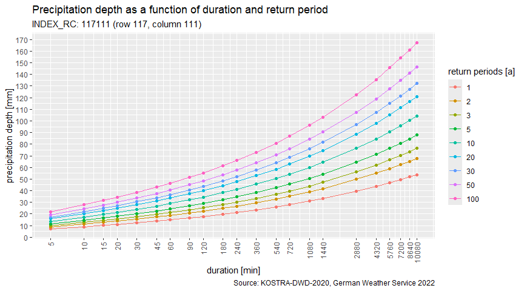

<!-- README.md is generated from README.Rmd. Please edit that file -->

# kostra2020

<!-- badges: start -->

[](https://github.com/dimfalk/kostra2020/actions/workflows/R-CMD-check.yaml)
[](https://app.codecov.io/gh/dimfalk/kostra2020?branch=main)

<!-- badges: end -->

— As of 01.01.2023, kostra2020 officially replaces kostra2010R (see
[dimfalk/kostra2010R](https://github.com/dimfalk/kostra2010R)). —

The main goal of kostra2020 is to provide access to KOSTRA-DWD-2020
dataset from within R.

Abstract (slightly modified) from the [official dataset
description](https://opendata.dwd.de/climate_environment/CDC/grids_germany/return_periods/precipitation/KOSTRA/KOSTRA_DWD_2020/Datensatzbeschreibung_KOSTRA-DWD-2020_en.pdf):

*This vector dataset contains statistical precipitation values as a
function of duration and return period. The scope of the data is the
engineering dimensioning of water management structures. These include,
sewerage networks, sewage treatment plants, pumping stations and
retention basins. They are also often used for the dimensioning of
drainage and infiltration systems. With the help of the data, however,
it is also possible to estimate the precipitation level of severe heavy
precipitation events with regard to their return periods. This
estimation is often used to assess damage events.*

*The dataset encompasses values of statistical precipitation (HN) and
uncertainty range (UC) for 22 duration levels D (5 min - 7 days) and 9
return periods Tn (1-100 a). Here, the dataset has been filtered for
grid cells with actual information available, reducing the full grid of
300 x 300 cells at a spatial resolution of 5 km to a relevant subset of
15,989 cells. Also, explicit rain donation (RN) information was removed
since this data can be reproduced on the fly. INDEX_RC describes the
unique identifier of a grid cell.*

*Further information can be found in the support documents at
<https://www.dwd.de/kostra>*

## Installation

You can install the development version of kostra2020 with:

``` r
install.packages("devtools")
devtools::install_github("dimfalk/kostra2020")
```

and load the package via

``` r
library(kostra2020)
```

## Getting started

### Get “INDEX_RC” based on row and column information

Sometimes identification of grid cells is not accomplished using
“INDEX_RC” directly but rather using a combination of X and Y
information (e.g. column 125, row 49). This information can easily be
used to generate the necessary “INDEX_RC” field.

``` r
# Generate "INDEX_RC" based on X and Y information.
idx_build(col = 125, row = 49)
#> [1] "49125"
```

If you wanted to check whether this constructed “INDEX_RC” field is
really present in the dataset (or you found an ID in some report and are
not sure, if it is still being used), make use of the following
function.

``` r
# Is the following "INDEX_RC" entry present in the dataset?
idx_exists("49125")
#> [1] TRUE
```

### Get “INDEX_RC” based on spatial information

The most common use case will be to get the relevant “INDEX_RC” based on
coordinates provided, e.g. for the location of a precipitation station
in order to be able to classify duration-specific precipitation depths
in terms of return periods.

``` r
# Sf objects created based on specified coordinates. Don't forget to pass the CRS.
p1 <- get_centroid(c(6.19, 50.46), epsg = 4326)
p1
#> Geometry set for 1 feature 
#> Geometry type: POINT
#> Dimension:     XY
#> Bounding box:  xmin: 6.19 ymin: 50.46 xmax: 6.19 ymax: 50.46
#> Geodetic CRS:  WGS 84
#> POINT (6.19 50.46)

p2 <- get_centroid(c(367773, 5703579), epsg = 25832)
p2
#> Geometry set for 1 feature 
#> Geometry type: POINT
#> Dimension:     XY
#> Bounding box:  xmin: 367773 ymin: 5703579 xmax: 367773 ymax: 5703579
#> Projected CRS: ETRS89 / UTM zone 32N
#> POINT (367773 5703579)
```

For convenience, it is also possible to provide municipality names or
postal codes to derive coordinates.

``` r
# Sf objects created based on Nominatim API response. Internet access required!
p3 <- get_centroid("52070")
p3
#> Geometry set for 1 feature 
#> Geometry type: POINT
#> Dimension:     XY
#> Bounding box:  xmin: 6.096156 ymin: 50.79107 xmax: 6.096156 ymax: 50.79107
#> Geodetic CRS:  WGS 84
#> POINT (6.096156 50.79107)

p4 <- get_centroid("Freiburg im Breisgau")
p4
#> Geometry set for 1 feature 
#> Geometry type: POINT
#> Dimension:     XY
#> Bounding box:  xmin: 7.8494 ymin: 47.99609 xmax: 7.8494 ymax: 47.99609
#> Geodetic CRS:  WGS 84
#> POINT (7.8494 47.99609)

p5 <- get_centroid("Kronprinzenstr. 24, 45128 Essen")
p5
#> Geometry set for 1 feature 
#> Geometry type: POINT
#> Dimension:     XY
#> Bounding box:  xmin: 7.020153 ymin: 51.44617 xmax: 7.020153 ymax: 51.44617
#> Geodetic CRS:  WGS 84
#> POINT (7.020153 51.44617)
```

These coordinates can be used subsequently to spatially query the
relevant grid index.

``` r
# Get indices by topological intersection between location point and grid cells.
get_idx(p1)
#> [1] "150090"
get_idx(p2)
#> [1] "129103"
get_idx(p3)
#> [1] "143089"
get_idx(p4)
#> [1] "206112"
get_idx(p5)
#> [1] "129102"
```

### Construct cell-specific statistics from KOSTRA-DWD-2020 grid

Now that we have messed a little with the grid cell identifiers, let’s
get a sneak peek into the dataset itself based on the “INDEX_RC”
specified.

``` r
# Build a tibble containing statistical precipitation depths as a function of 
# duration and return periods for the grid cell specified.
kostra <- get_stats("49125")

kostra
#> # A tibble: 22 × 12
#>    D_min D_hour D_day HN_001A HN_002A HN_003A HN_005A HN_010A HN_020A HN_030A
#>    <dbl>  <dbl> <dbl>   <dbl>   <dbl>   <dbl>   <dbl>   <dbl>   <dbl>   <dbl>
#>  1     5   NA      NA     6       7.4     8.2     9.3    10.8    12.4    13.5
#>  2    10   NA      NA     7.8     9.5    10.6    12      14      16.1    17.4
#>  3    15   NA      NA     8.9    10.9    12.1    13.7    16      18.4    19.9
#>  4    20   NA      NA     9.7    11.9    13.2    15      17.5    20.1    21.8
#>  5    30   NA      NA    11      13.4    15      16.9    19.8    22.8    24.7
#>  6    45   NA      NA    12.4    15.1    16.8    19.1    22.3    25.6    27.8
#>  7    60    1      NA    13.5    16.4    18.3    20.7    24.2    27.8    30.2
#>  8    90    1.5    NA    15.1    18.4    20.5    23.2    27.2    31.2    33.9
#>  9   120    2      NA    16.4    20      22.2    25.2    29.4    33.8    36.7
#> 10   180    3      NA    18.3    22.4    24.9    28.2    32.9    37.9    41.1
#> # ℹ 12 more rows
#> # ℹ 2 more variables: HN_050A <dbl>, HN_100A <dbl>
```

Some describing attributes have been assigned to the tibble.

``` r
attr(kostra, "id")
#> [1] "49125"
attr(kostra, "period")
#> [1] "1951-01-01 +01" "2020-12-31 +01"
attr(kostra, "returnperiods_a")
#> [1]   1   2   3   5  10  20  30  50 100
attr(kostra, "source")
#> [1] "KOSTRA-DWD-2020"
```

### Get precipitation depths and uncertainties, calculate precipitation yield

If we now wanted to know the statistical precipitation depth e.g. for an
event of 4 hours duration corresponding to a recurrence interval in
1:100 years, it’s just a matter of indexing. However, there is a
function helping you out.

``` r
# So we are interested in the rainfall amount [mm] for an event lasting 240 min 
# with a return period of 100 a.
get_depth(kostra, d = 240, tn = 100)
#> 55.6 [mm]
```

In order to respect estimated grid cell specific uncertainties now
additionally included in kostra2020, make use of `uc = TRUE` to get an
interval centered around the single value above.

``` r
# Same data, but with uncertainties considered.
get_depth(kostra, d = 240, tn = 100, uc = TRUE)
#> Units: [mm]
#> [1] 43.4 67.8
```

Uncertainties are caused on the one hand by the statistical procedures
themselves, but on the other hand also by the regionalisation procedure
and by erroneous or missing observations. The uncertainties vary
regionally and depend on the duration level and return period. For
example, the rarer an event occurs statistically, the greater the
uncertainties.

Specific uncertainty data is available for each grid cell and for each
combination of duration level D and return period Tn. Please note that
uncertainty ranges are given in ± %.

``` r
# Inspect raw uncertainties used above.
get_uncertainties("49125")
#> # A tibble: 22 × 12
#>    D_min D_hour D_day UC_001A UC_002A UC_003A UC_005A UC_010A UC_020A UC_030A
#>    <dbl>  <dbl> <dbl>   <dbl>   <dbl>   <dbl>   <dbl>   <dbl>   <dbl>   <dbl>
#>  1     5   NA      NA      16      17      18      19      20      20      21
#>  2    10   NA      NA      17      19      20      21      22      23      24
#>  3    15   NA      NA      18      20      21      22      24      25      25
#>  4    20   NA      NA      18      21      22      23      24      25      26
#>  5    30   NA      NA      18      21      22      23      24      25      26
#>  6    45   NA      NA      18      20      21      22      24      25      25
#>  7    60    1      NA      17      19      21      22      23      24      25
#>  8    90    1.5    NA      16      18      19      21      22      23      24
#>  9   120    2      NA      15      18      19      20      21      22      23
#> 10   180    3      NA      14      16      17      19      20      21      21
#> # ℹ 12 more rows
#> # ℹ 2 more variables: UC_050A <dbl>, UC_100A <dbl>
```

If you need precipitation yield values \[l/(s\*ha)\] instead of
precipitation depth \[mm\] or vice versa, make use of the following
helper function.

``` r
as_yield(55.6, d = 240)
#> 38.6 [L/ha/s]

as_depth(38.6, d = 240)
#> 55.6 [mm]
```

### Get return periods

Finally, we want to determine the return period according to the dataset
for a precipitation depth and duration given.

``` r
# Let's assume we measured 72.3 mm in 24 h.
get_returnp(kostra, hn = 75.3, d = 1440)
#> Units: [a]
#> [1] 30 50
```

Accordingly, the approximate corresponding recurrence interval resp.
annuality of this event amounts to something between 30 and 50 years as
per KOSTRA-DWD-2020.

The following edge cases are to be mentioned:

``` r
# 1) In case a class boundary is hit, the return period is replicated.
get_returnp(kostra, hn = 39.5, d = 1440)
#> Units: [a]
#> [1] 2 2
```

``` r
# 2) In case the return period tn is smaller than 1, interval opens with 0.
get_returnp(kostra, hn = 30.2, d = 1440)
#> Units: [a]
#> [1] 0 1
```

``` r
# 3) In case the return period tn is larger than 100, interval closes with Inf.
get_returnp(kostra, hn = 96.3, d = 1440)
#> Units: [a]
#> [1] 100 Inf
```

### Return period interpolation

Although it may be somewhat questionable from a scientific perspective,
you might nevertheless be interested in the return period estimated
using linear interpolation between adjacent nodes:

``` r
# Using the same example as above, previously resulting in 30 a < tn < 50 a.
get_returnp(kostra, hn = 75.3, d = 1440, interpolate = TRUE)
#> 37.3 [a]
```

### Design storm generation

Furthermore, statistical precipitation depths can be used to create
design storm time series data. Currently, Euler Type I + II are
implemented.

``` r
# Euler Type II design storm with a duration of 60 minutes and a return period of 100 a.
xts <- calc_designstorm(kostra, d = 60, tn = 100, type = "EulerII")

xts
#>                      [,1]
#> 2000-01-01 00:00:00  2.40
#> 2000-01-01 00:05:00  3.10
#> 2000-01-01 00:10:00  4.90
#> 2000-01-01 00:15:00 16.90
#> 2000-01-01 00:20:00  1.75
#> 2000-01-01 00:25:00  1.75
#> 2000-01-01 00:30:00  1.30
#> 2000-01-01 00:35:00  1.30
#> 2000-01-01 00:40:00  1.30
#> 2000-01-01 00:45:00  1.00
#> 2000-01-01 00:50:00  1.00
#> 2000-01-01 00:55:00  1.00
```

### Further utilization

Data can now be visualized via `ggplot2` after a quick wide-to-long
conversion…

``` r
library(ggplot2)

# Column name extraction for name/value junction
cnames <- colnames(kostra)[colnames(kostra) |> stringr::str_detect("HN_*")]

# Making use of tidyr
longdata <- tidyr::pivot_longer(kostra, cols = all_of(cnames))

# Plot the whole dataset, colors according to return periods
ggplot(longdata, aes(D_min, value, colour = name)) + 
  geom_point() +
  geom_line() +
  xlab("duration [min]") +
  ylab("precipitation depth [mm]") +
  ggtitle(paste0("hN as a function of duration and return periods as per ", attr(kostra, "source")),
          subtitle = paste0("INDEX_RC: ", attr(kostra, "id")))
```



… or exported to disk using `write.csv2()`.

## Contributing

See
[here](https://github.com/dimfalk/kostra2020/blob/main/.github/CONTRIBUTING.md)
if you’d like to contribute.

## Legal information

According to the [terms of
use](https://opendata.dwd.de/climate_environment/CDC/Terms_of_use.pdf)
for data on the CDC-OpenData area, freely accessible data may be re-used
without any restrictions provided other than the source is referenced,
as laid down in the
[GeoNutzV](http://www.gesetze-im-internet.de/geonutzv/index.html)
ordinance.

Copyright @ [Deutscher
Wetterdienst](https://www.dwd.de/EN/service/copyright/templates_dwd_as_source.html)
